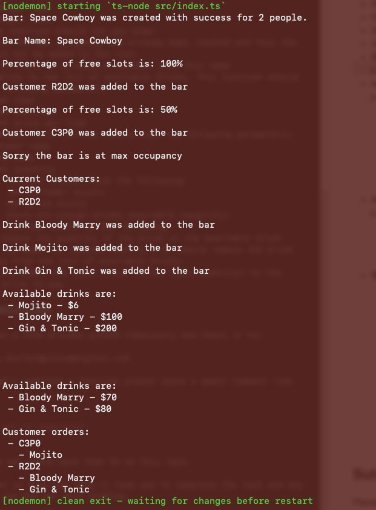

# Coding Test 

**Codename:** SPACE-BAR-001

This is a small test to understand the reasoning behind the following problems. 

The following languages are supported (pick one):

- PHP
- JavaScript
- TypeScript

You are not allowed to use additional packages or libraries.

There is no need to create any html or css. 

**Displaying information should be done through `echo` or `console.log`**

**Do not create or use databases for this exercice. Use objects and arrays.**

## Background

Welcome to the year 2256, humans have made it to space and met many other races from various galaxies. Your client is a small space bar that needs help managing their inventory and clients.

You are tasked to make a class in one of the languages mentioned above that will follow the below instructions.


## Instructions

### Class

The class should be named `Bar`.

It should take in a few parameters when being initialized:

- bar name
- max Occupancy (number of peoples allowed in bar)

The class should be able to track the following information:

- List of current customers
	- customer name
	- customer race
	- customer price to pay

- List of currently available drinks
	- drink name
	- drink quantity
	- drink price per item

- List of bought drinks
	- drink name
	- drink quantity
	- customer name
	- total price

### Class functions

The following actions should be available in the class:

- Display bar name and max occupancy
- Display the percentage of free occupancy slots
- Display list of current customers alphabetically by name
- Display list of current drinks by highest total price (quantity times the price per item)
- Display list of all bought drinks ordered by total price (smallest first)
- Display list of all customers that have bought drinks and all the drinks they have bought.
- Add a customer to the current customer list. This should take the following parameters:
	- customer name
	- customer race
	- this function should let you know:
		- if the max occupancy had already been reached and thus the user could not be added to the list.
		- if there is already a customer with this name
- Add a drink to the list of available drinks. This function should take the following parameters:
	- drink name
	- drink quantity
	- drink price per item
- Buy a drink. This function should take the following parameters:
	- customer name
	- drink name
	- drink quantity
	- The function should check the following:
		- 	the customer exists
		-  the drink exists
		-  there are enough drinks available (quantity)
	- The function should do the following
		- remove the quantity of the drink in the available drink list. If the quantity reaches exactly 0 it should remove the drink completely from the list of available drinks.
		- increment the total price (drink times quantity) to the customer price to pay


## Example

Ouput example:



Test Example:

```ts
const myBar = new Bar("Space Cowboy", 2)
myBar.name()
myBar.occupancy()
myBar.addCustomer("R2D2", "robot")
myBar.occupancy()
myBar.addCustomer("C3P0", "robot")
myBar.addCustomer("Sheriff", "human")
myBar.displayCustomers()
myBar.addDrink("Bloody Marry", 10, 10)
myBar.addDrink("Mojito", 2, 3)
myBar.addDrink("Gin & Tonic", 5, 40)
myBar.displayDrinks()
myBar.buyDrink("C3P0", "Mojito", 2)
myBar.buyDrink("R2D2", "Bloody Marry", 3)
myBar.buyDrink("R2D2", "Gin & Tonic", 3)
myBar.displayDrinks()
myBar.displayBoughtDrinks()
```


## Installation and run

#### Prerequisites:

- nodemon
- ts-node

#### Build
`npm install` then `npm run build` to install the dependancies and produce the build.

#### Run

`npm run dev` to run the application.

---
